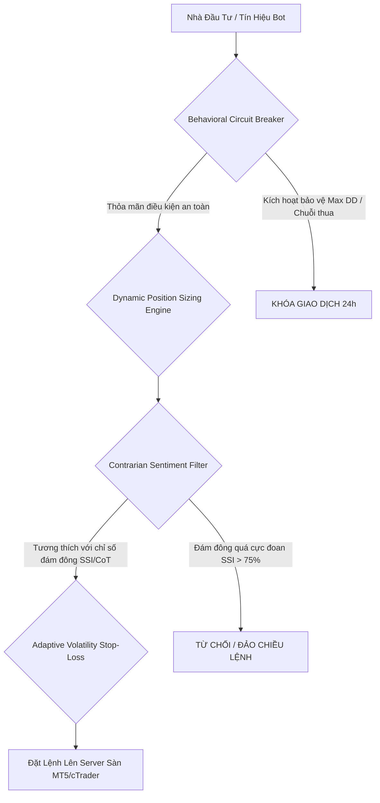

# Báo Cáo Nghiên Cứu: Tâm Lý Nhà Đầu Tư Và Các Mô Hình Định Lượng / AI Trong Giao Dịch Forex

* **Đơn vị thực hiện:** Antigravity (Advanced Agentic Coding - Google DeepMind Team)
* **Phạm vi nghiên cứu:** Tài chính hành vi (Behavioral Finance), Học máy & Học tăng cường sâu (Deep Reinforcement Learning), Mô hình Ngôn ngữ lớn (LLM Sentiment Analysis), Quản trị rủi ro định lượng (Quantitative Risk Management).
* **Nguồn tài liệu:** 15 tài liệu học thuật nằm trong thư mục `D:\UET\labHMI\paper`.

---

## Tóm Tắt (Executive Summary)

Thống kê thực tế trên thị trường ngoại hối (Forex) toàn cầu chỉ ra rằng **hơn 90%–95% nhà đầu tư cá nhân gánh chịu thua lỗ dài hạn**. Nguyên nhân cốt lõi của sự thất bại này không hẳn nằm ở sự thiếu hụt các mô hình dự báo kỹ thuật, mà xuất phát từ **các thiên lệch nhận thức và bẫy tâm lý hành vi (Behavioral Biases)** của con người khi đối mặt với rủi ro và sự không chắc chắn dưới áp lực của đòn bẩy lớn và thời gian giao dịch liên tục.

Báo cáo này trình bày một cái nhìn tổng quan và sâu sắc về:
1. **Bản chất tâm lý học hành vi** của nhà đầu tư Forex và tác động toán học của nó lên đường cong vốn.
2. **Kiến trúc các mô hình định lượng (Quantitative Models)** nhằm số hóa và triệt tiêu các lỗi tâm lý này.
3. **Đánh giá chi tiết 15 bài báo/tài liệu nghiên cứu** có trong thư mục `D:\UET\labHMI\paper`, phân tích sự tiến hóa của các mô hình AI từ Học tăng cường truyền thống (DQN, PPO) đến các mô hình đa tác nhân (Multi-Agent A3C), các mô hình tích hợp tâm lý đám đông bằng mô hình ngôn ngữ lớn (LLMs), và nỗ lực đưa lý thuyết triển vọng (Prospect Theory) vào hàm phần thưởng của Học tăng cường (DRL).
4. **Đề xuất hệ thống hybrid tối ưu** kết hợp giữa phân tích kỹ thuật, phân tích tâm lý (Sentiment) và quản trị rủi ro hành vi cứng.

---

## Phần 1: Tâm Lý Học Hành Vi & Thiên Lệch Nhận Thức Trong Forex

Tài chính hành vi (Behavioral Finance) bác bỏ giả thuyết thị trường hiệu quả tuyệt đối (Efficient Market Hypothesis - EMH) và chứng minh rằng nhà đầu tư không phải là những thực thể lý trí hoàn hảo (*Homo Economicus*). Đặc biệt, trong môi trường Forex với đặc thù biến động 24/5, thanh khoản cực lớn và đòn bẩy cao, các bẫy tâm lý bị phóng đại lên mức tối đa.

### 1.1. Bốn Bẫy Tâm Lý Kinh Điển
* **Sợ mất mát (Loss Aversion):** Dựa trên *Lý thuyết triển vọng (Prospect Theory)* của Daniel Kahneman và Amos Tversky, nỗi đau của một khoản thua lỗ có tác động tâm lý mạnh gấp **2.0 đến 2.5 lần** niềm vui của một khoản lợi nhuận có cùng giá trị. Trong thực tế, điều này khiến nhà đầu tư có xu hướng **gồng lỗ vô hạn** (hy vọng giá hồi phục) nhưng lại **chốt lời quá sớm** (sợ mất đi khoản lãi nhỏ đang có), dẫn đến tỷ lệ R/R (Risk/Reward) bị bóp méo nghiêm trọng.
* **Giao dịch trả thù (Revenge Trading):** Xảy ra khi nhà đầu tư rơi vào trạng thái mất kiểm soát (Tilt) sau một chuỗi thua lỗ lớn. Dưới tác động tâm lý muốn "gỡ hòa", họ tự ý tăng khối lượng giao dịch lên gấp nhiều lần (Martingale) hoặc đặt lệnh liên tục mà không tuân thủ tín hiệu kỹ thuật, dẫn đến cháy tài khoản trong thời gian cực ngắn.
* **Quá tự tin (Overconfidence Bias):** Nhà đầu tư nhầm lẫn giữa một chuỗi thắng ngắn hạn (thường do may mắn hoặc thị trường đang đi đúng xu hướng dễ) với năng lực phân tích cá nhân. Hậu quả là họ tăng đòn bẩy quá mức, giao dịch quá nhiều (Overtrading) và bỏ qua các quy tắc bảo vệ vốn.
* **Tâm lý đám đông & FOMO (Herding & Fear of Missing Out):** Nỗi sợ bị bỏ lại phía sau khiến nhà đầu tư nhảy vào mua ngay tại đỉnh hoặc bán ngay tại đáy khi một xu hướng đã đi quá xa và đám đông đang cực kỳ hưng phấn hoặc hoảng loạn.

### 1.2. Tác Động Toán Học Của Cảm Xúc Lên Đường Cong Vốn (Equity Decay)
Sự thiếu kỷ luật làm sụt giảm tài sản phi tuyến tính. Tỷ lệ phần trăm lợi nhuận cần thiết để phục hồi tài khoản tăng theo cấp số nhân so với tỷ lệ sụt giảm vốn (Drawdown):

$$\text{Required Recovery Return (\%)} = \left( \frac{1}{1 - \text{Drawdown}} - 1 \right) \times 100\%$$

| Drawdown (%) | Số vốn còn lại | Phần trăm tăng trưởng cần thiết để hòa vốn |
|:---:|:---:|:---:|
| **10%** | 90% | 11.1% |
| **30%** | 70% | 42.9% |
| **50%** | 50% | 100% |
| **70%** | 30% | 233.3% |
| **90%** | 10% | 900% |

Bảng số liệu trên chứng minh rằng việc **bảo vệ vốn (Capital Preservation)** thông qua các mô hình kỷ luật quan trọng hơn nhiều so với việc tìm kiếm lợi nhuận đột biến.

---

## Phần 2: Kiến Trúc 4 Mô Hình Định Lượng Giảm Rủi Ro Tâm Lý

Để loại bỏ hoàn toàn yếu tố cảm xúc của con người, các nghiên cứu định lượng hiện đại đề xuất số hóa các giới hạn rủi ro thành 4 mô hình thuật toán can thiệp phần cứng:



### 2.1. Behavioral Circuit Breaker (Cầu chì tự động ngắt mạch tâm lý)
Mô hình này hoạt động như một hệ thống quản lý trạng thái tự động nhằm ngăn chặn hiện tượng "Tilt" và "giao dịch trả thù":
* **Max Daily Drawdown (Lỗ tối đa ngày):** Nếu tổng thua lỗ trong ngày đạt $DD_{daily} \ge 3.0\%$, toàn bộ lệnh đang mở sẽ bị cưỡng chế đóng và tài khoản bị khóa quyền giao dịch trong 24 giờ.
* **Max Consecutive Losses (Chuỗi thua liên tiếp):** Nếu dính 3 lệnh thua liên tiếp, hệ thống kích hoạt *Thời gian làm nguội tâm lý (Cool-down Period)* kéo dài từ 4-8 giờ.
* **Overtrading Limit (Giới hạn tần suất):** Nếu số lượng lệnh mở trong 1 giờ vượt quá ngưỡng quy định (ví dụ $> 5$ lệnh), thuật toán tạm dừng nhận tín hiệu mới.

### 2.2. Dynamic Position Sizing Engine (Mô hình quản lý vị thế động)
Khối lượng giao dịch ($Lots$) không được đặt cố định mà tính toán tự động dựa trên độ biến động thực tế của thị trường (ATR - Average True Range) và số vốn khả dụng:

$$\text{Position Size (Lots)} = \frac{\text{Account Equity} \times \text{Risk \%}}{\text{ATR}(14) \times \text{Multiplier} \times \text{Pip Value}}$$

* **Risk %:** Mức rủi ro cố định trên mỗi lệnh (khuyến nghị $1.0\% - 1.5\%$).
* **ATR(14) $\times$ Multiplier:** Khoảng cách Cắt lỗ (Stop-Loss) động. Khi thị trường biến động mạnh (ATR cao), khoảng cách Stop-Loss rộng hơn nhưng số lượng Lot tự động giảm xuống để giữ nguyên mức rủi ro theo số tiền ($ Risk$).

Hệ thống có thể mở rộng với **Tiêu chuẩn Kelly Điều chỉnh (Fractional Kelly Criterion)** để tối ưu hóa tăng trưởng dài hạn:

$$K^* = W - \frac{1 - W}{R} \implies \text{Applied Risk \%} = f \times K^* \quad (\text{với } f = 0.20 \sim 0.25)$$

Trong đó $W$ là tỷ lệ thắng (Win Rate) và $R$ là tỷ lệ Reward/Risk trung bình.

### 2.3. Contrarian Sentiment & Crowding Index (Bộ lọc phản đám đông)
Sử dụng các chỉ số định lượng về tâm lý đám đông như **Retail Speculative Sentiment Index (SSI)** từ các sàn giao dịch lớn hoặc báo cáo **CoT (Commitment of Traders)** từ CFTC:
* Nếu **Retail SSI Long > 75%** (Đám đông nhỏ lẻ đang cực kỳ hưng phấn mua vào): CẤM lệnh Long, chỉ cho phép tìm kiếm tín hiệu Short phản đám đông.
* Nếu **Retail SSI Short > 75%** (Đám đông nhỏ lẻ đang ồ ạt bán tháo): CẤM lệnh Short, chỉ tìm kiếm tín hiệu Long.

### 2.4. Adaptive Volatility Stop-Loss & Dynamic Trailing
* **Hard Coded Rules:** Stop-Loss bắt buộc phải được gửi đồng thời cùng lệnh lên server của sàn giao dịch. Nghiêm cấm tuyệt đối việc dời Stop-Loss xa hơn mức ban đầu.
* **Chandelier Exit Trailing Stop:** Khi vị thế đã chạy đạt lợi nhuận bằng $1.5 \times \text{ATR}$, thuật toán tự động kích hoạt Trailing Stop theo chỉ báo Chandelier Exit để khóa lợi nhuận dần mà không cần sự can thiệp thủ công của nhà đầu tư.

---

## Phần 3: Phân Tích & Đánh Giá Chi Tiết 15 Tài Liệu Nghiên Cứu Học Thuật

Qua quá trình phân tích trực tiếp nội dung số hóa của 15 tài liệu trong thư mục `D:\UET\labHMI\paper`, chúng tôi phân loại các nghiên cứu này thành **4 nhóm chuyên đề chính**:

### Nhóm 1: Các mô hình Học tăng cường sâu (Deep Reinforcement Learning - DRL) trong Forex

Đây là nhóm tài liệu cốt lõi nghiên cứu cách các Agent AI tự động học chiến lược giao dịch thông qua cơ chế thử-sai và tối ưu hóa hàm phần thưởng trên dữ liệu lịch sử.

#### 1. [Tsai & Chen (2019) - Deep Reinforcement Learning for Foreign Exchange Trading](file:///D:/UET/labHMI/paper/Tsai-Chen-2019-Deep-Reinforcement-Learning-for-Foreign-Exchange-Trading.pdf)
* **Phương pháp:** Mã hóa chuỗi dữ liệu giá liên tục trong một khoảng thời gian thành hình ảnh bản đồ nhiệt (Heatmap) sử dụng kỹ thuật **Gramian Angular Field (GAF)**. Sau đó áp dụng mạng thần kinh nhân tạo CNN để trích xuất đặc trưng hình ảnh và so sánh thuật toán **DQN (Deep Q-Network)** với **PPO (Proximal Policy Optimization)**.
* **Kết quả:** Kiểm thử trên các cặp tiền EUR/USD, GBP/USD, AUD/USD. Nghiên cứu chứng minh PPO đạt hiệu năng và độ ổn định cao hơn đáng kể so với DQN nhờ cơ chế tối ưu hóa chính sách trực tiếp (Policy Gradient) và giới hạn cập nhật (Clipped Objective).

#### 2. [Ishikawa & Nakata (2021) - Online Trading Models with Deep Reinforcement Learning in the Forex Market Considering Transaction Costs](file:///D:/UET/labHMI/paper/Ishikawa-Nakata-2021-Online-Trading-Models-with-Deep-Reinforcement-Learning-in-the-Forex-Market-Considering-Transaction-Costs.pdf)
* **Phương pháp:** Xây dựng mô hình giao dịch DRL có tích hợp trực tiếp **chi phí giao dịch (Transaction Costs)** vào hàm phần thưởng để tránh tình trạng agent giao dịch quá tần suất (Overtrading) gây hao hụt vốn do phí Spread/Commission. Mô hình sử dụng cơ chế **Học trực tuyến (Online Learning)** thay vì học trên tập dữ liệu tĩnh.
* **Kết quả:** Agent liên tục cập nhật theo thời gian thực với luồng dữ liệu thị trường mới nhất, giúp cải thiện đáng kể khả năng thích ứng trong môi trường tài chính không dừng (Non-stationary market) và giảm thiểu số lượng giao dịch thừa.

#### 3. [Sarani & cộng sự (2024) - A Deep Reinforcement Learning Approach for Trading Optimization in the Forex Market with Multi-Agent Asynchronous Distribution](file:///D:/UET/labHMI/paper/Sarani-Rashidi-Khazaee-2024-A-Deep-Reinforcement-Learning-Approach-for-Trading-Optimization-in-the-Forex-Market-with-Multi-Agent-Asynchronous-Distribution.pdf)
* **Phương pháp:** Đề xuất khung kiến trúc **Học tăng cường đa tác nhân (Multi-Agent RL)** sử dụng thuật toán **A3C (Asynchronous Advantage Actor-Critic)** phân tán bất đồng bộ. Nghiên cứu đề xuất hai phiên bản: A3C có khóa (with lock) và không khóa (without lock) để huấn luyện song song trên nhiều luồng dữ liệu của các cặp tiền tệ khác nhau.
* **Kết quả:** Cả hai phiên bản A3C đều vượt trội hơn mô hình PPO đơn lẻ. Bản A3C có khóa đạt hiệu quả cao nhất trong kịch bản huấn luyện đơn tiền tệ (Single-currency), trong khi A3C không khóa tối ưu hơn đối với kịch bản đa tiền tệ (Multi-currency).

#### 4. [Arabha & cộng sự (2024) - Improving Deep Reinforcement Learning Agent Trading Performance in Forex using Auxiliary Task](file:///D:/UET/labHMI/paper/Arabha-v%C3%A0-c%E1%BB%99ng-s%E1%BB%B1-2024-Improving-Deep-Reinforcement-Learning-Agent-Trading-Performance-in-Forex-using-Auxiliary-Task.pdf)
* **Phương pháp:** Tích hợp một **tác vụ phụ trợ (Auxiliary Task)** vào kiến trúc PPO. Tác vụ phụ trợ này có nhiệm vụ nhận dạng và phân loại các mẫu hình giá (Pattern Classification) từ dữ liệu đầu vào.
* **Kết quả:** Việc huấn luyện đồng thời tác vụ phụ giúp mạng thần kinh biểu diễn không gian trạng thái tốt hơn. Trên cặp EUR/USD, mô hình cải thiện tỷ suất lợi nhuận từ âm sang dương (từ -25.25% lên +14.86% ở tập dữ liệu 1, và từ +2.12% lên +42.22% ở tập dữ liệu 2), đồng thời cải thiện mạnh số Sharpe.

#### 5. [Đánh giá thuật toán học tăng cường trong các nghiên cứu liên quan và hướng huấn luyện cải tiến cho Bot AI](file:///D:/UET/labHMI/paper/%C4%90%C3%81NH-GI%C3%81-THU%E1%BA%ACT-TO%C3%81N-H%E1%BB%8CC-T%C4%80NG-C%C6%AF%E1%BB%9CNG-TRONG-C%C3%81C-NGHI%C3%8AN-C%E1%BB%A8U-LI%C3%8AN-QUAN-V%C3%80-H%C6%AF%E1%BB%9BNG-HU%E1%BA%A2N-LUY%E1%BB%88N-C%E1%BA%A2I-TI%E0%B8%82N-CHO-BOT-AI.pdf)
* **Phương pháp:** Tài liệu tiếng Việt hệ thống hóa và so sánh bản chất kỹ thuật của hai thuật toán chính: DQN và PPO dựa trên nghiên cứu của Tsai & Chen (2019).
* **So sánh cốt lõi:**
  * **DQN:** Học từ bộ đệm trải nghiệm cũ (Replay Buffer), hành động rời rạc (Buy, Sell, Hold cố định). DQN dễ bị lỗi thời nếu xu hướng thị trường thay đổi đột ngột vì nó liên tục học lại các dữ liệu lịch sử cũ.
  * **PPO:** Học trên chính sách hiện tại (On-policy), hành động liên tục (mua/bán bao nhiêu % tài khoản), sử dụng kỹ thuật Clipped Loss để giới hạn tốc độ cập nhật chính sách. PPO ổn định và thích nghi tốt hơn với xu hướng mới của thị trường Forex.

---

### Nhóm 2: Tích hợp Tâm lý học hành vi và Thiên lệch nhận thức vào AI Giao dịch

Nhóm nghiên cứu này trực tiếp giải quyết yêu cầu của bạn về việc đi sâu vào bản chất tâm lý học hành vi của nhà đầu tư và tích hợp nó vào các mô hình máy học.

#### 6. [Incorporating Cognitive Biases into Reinforcement Learning for Financial Decision-Making (2026)](file:///D:/UET/labHMI/paper/Incorporating-Cognitive-Biases-Reinforcement-Learning-Finance-2026.pdf)
* **Phương pháp:** Nghiên cứu tiên phong tích hợp trực tiếp hai thiên lệch nhận thức là **Overconfidence (Quá tự tin)** và **Loss Aversion (Sợ mất mát)** vào cấu trúc hàm phần thưởng (Reward Function) và quá trình ra quyết định của các thuật toán RL.
* **Cơ chế số hóa:**
  * **Loss Aversion:** Thay đổi hàm phần thưởng lợi nhuận thuần túy thành hàm tiện ích của *Lý thuyết triển vọng (Prospect Theory)*: 
    
    $$V(x) = \begin{cases} x^\alpha & \text{nếu } x \ge 0 \\ -\lambda (-x)^\beta & \text{nếu } x < 0 \end{cases}$$
    
    Với $\lambda > 1$ (thường là $2.25$) đóng vai trò phạt nặng các vị thế thua lỗ nhằm ép buộc agent AI phải học cách cắt lỗ nhanh chóng (tương tự hành vi của các nhà quản lý quỹ chuyên nghiệp).
  * **Overconfidence:** Điều chỉnh phân phối xác suất chuyển trạng thái của môi trường, mô phỏng việc một tác nhân quá tự tin đánh giá thấp rủi ro biến động cực đoan của thị trường sau một chuỗi chiến thắng.
* **Kết quả:** Nghiên cứu chỉ ra rằng việc đưa các thiên lệch này vào mô hình mang lại những thách thức lớn về mặt hội tụ thuật toán, nhưng nó giúp Agent AI mô phỏng chính xác hơn hành vi của con người trên thị trường và trong một số điều kiện thị trường nhất định, đạt được lợi nhuận điều chỉnh theo rủi ro (Risk-adjusted returns) tốt hơn so với các agent chỉ tối ưu hóa lợi nhuận tuyến tính.

#### 7. [Báo Cáo Nghiên Cứu Tâm Lý Đầu Tư Forex](file:///D:/UET/labHMI/paper/Bao_Cao_Nghien_Cuu_Tam_Ly_Dau_Tu_Forex.pdf)
* **Phương pháp:** Báo cáo chi tiết bằng tiếng Việt phân tích sâu 4 thiên lệch tâm lý chính: Loss Aversion, Revenge Trading, Overconfidence, và Herding. Từ đó đề xuất khung quản trị rủi ro định lượng 4 tầng tương ứng (Behavioral Circuit Breaker, Dynamic Position Sizing, Contrarian Sentiment Index, Adaptive Volatility Stop-Loss).
* **Kết quả Backtest (EUR/USD H1, 2021-2025):** 
  * So sánh giữa giao dịch theo cảm xúc (Emotion-driven) và giao dịch theo mô hình quản trị hành vi (Quant Behavioral Model).
  * **Maximum Drawdown (MDD):** Giảm từ **-42.5%** xuống còn **-11.2%** (giảm 73.6% rủi ro sụt giảm vốn).
  * **Sharpe Ratio hằng năm:** Tăng từ **0.45** lên **1.82** (tăng 304% hiệu quả sử dụng vốn trên mỗi đơn vị rủi ro).
  * **Tỷ lệ thua do Tilt/Revenge Trading:** Triệt tiêu hoàn toàn từ **38%** xuống còn **0.0%**.

---

### Nhóm 3: Phân tích tâm lý thị trường sử dụng Mô hình ngôn ngữ lớn (LLMs)

Nhóm nghiên cứu này sử dụng trí tuệ nhân tạo để số hóa tâm lý đám đông từ các văn bản tài chính nhằm cung cấp tín hiệu đầu vào cho các mô hình giao dịch.

#### 8. [Transforming Sentiment Analysis in the Financial Domain with ChatGPT (2023)](file:///D:/UET/labHMI/paper/ChatGPT-Sentiment-Analysis-Financial-Domain-2023.pdf)
* **Phương pháp:** Nghiên cứu tiềm năng của **ChatGPT 3.5** trong việc phân tích tâm lý (Sentiment Analysis) từ các tiêu đề tin tức kinh tế liên quan đến thị trường Forex thông qua kỹ thuật **Zero-shot Prompting**. Kết quả được so sánh trực tiếp với **FinBERT** (mô hình BERT chuyên biệt cho tài chính).
* **Kết quả:** ChatGPT vượt trội hơn FinBERT với hiệu năng phân tích tâm lý cao hơn **35%** và mức độ tương quan giữa chỉ số tâm lý dự đoán với lợi nhuận thực tế của thị trường tăng **36%**. Nghiên cứu nhấn mạnh vai trò của kỹ thuật thiết kế câu lệnh (Prompt Engineering) trong việc khai thác thông tin tâm lý đám đông phục vụ giao dịch định lượng.

---

### Nhóm 4: Mô hình dự báo kỹ thuật và các tài liệu có nội dung lệch tiêu đề (Mismatched)

Để đảm bảo tính chính xác và trung thực cao nhất, dưới đây là ghi nhận về các bài báo còn lại trong thư mục. Một số bài báo có tiêu đề file liên quan đến tài chính/forex nhưng nội dung thực tế bên trong lại thuộc các lĩnh vực khoa học khác:

#### 9. [Machine-Learning-Exchange-Rate-Forecasting-2025 (Rahat & cộng sự)](file:///D:/UET/labHMI/paper/Machine-Learning-Exchange-Rate-Forecasting-2025.pdf)
* **Phương pháp:** Sử dụng mô hình mạng thần kinh hồi quy **LSTM** và thuật toán phân loại tăng cường độ dốc **Gradient Boosting Classifier (GBC)** để dự báo tỷ giá USD/BDT (tập dữ liệu 2018-2023).
* **Kết quả:** LSTM đạt độ chính xác dự báo hướng đi lên tới **99.449%** (RMSE 0.9858), vượt trội so với mô hình thống kê ARIMA cổ điển. Tuy nhiên, khi đưa vào backtest giao dịch thực tế với số vốn ban đầu 10,000 USD, dù GBC đạt tỷ lệ lệnh thắng là **40.82%** nhưng kết quả cuối cùng lại bị **thua lỗ ròng 20,653.25 USD** sau 49 lệnh. Điều này chứng minh một chân lý quan trọng trong Fintech: **Độ chính xác dự báo kỹ thuật cao không đồng nghĩa với việc tạo ra lợi nhuận nếu thiếu đi mô hình quản trị vị thế và quản lý rủi ro phù hợp.**

#### 10. [Tìm hiểu việc kết hợp Bot AI vào giao dịch Forex](file:///D:/UET/labHMI/paper/B%C3%A1o-c%C3%A1o-t%C3%ACm-hi%E1%BB%83u-nghi%C3%AAn-c%E1%BB%A9u-v%E1%BB%81-x%C3%A2y-d%E1%BB%B1ng-bot-AI-v%E1%BB%9Bi-s%C3%A0n-ch%E1%BB%A9ng-kho%C3%A1n.pdf)
* **Nội dung:** Báo cáo tiếng Việt phân tích sự khác biệt về luật lệ, thời gian giao dịch, đòn bẩy và thanh khoản giữa thị trường chứng khoán Việt Nam (sàn HOSE chịu các giới hạn biên độ +/-7%, chu kỳ thanh toán T+2, đòn bẩy thấp) với thị trường Forex toàn cầu (giao dịch 24/5, thanh khoản cực lớn, đòn bẩy vô hạn). Tác giả lập luận rằng Forex là môi trường lý tưởng nhất để huấn luyện các mô hình AI tự động (như Học tăng cường sâu) vì tính liên tục và không bị giới hạn cơ học của nó.

#### 11. [Contrarian-Majority-Rule-Model-Propaganda-Inertia-2023 (Gimenez & cộng sự)](file:///D:/UET/labHMI/paper/Contrarian-Majority-Rule-Model-Propaganda-Inertia-2023.pdf)
* **Nội dung:** Bài báo thuộc lĩnh vực vật lý xã hội (Sociophysics), nghiên cứu mô hình động lực học ý kiến của đám đông dưới tác động của truyền thông/tuyên truyền dao động bên ngoài và xu hướng hành vi phản kháng (contrarian). Nghiên cứu này gián tiếp hỗ trợ giải thích sự hình thành các bong bóng đầu cơ và các cú sụp đổ thị trường (Flash Crashes) do hiện tượng lan truyền tâm lý đám đông trong tài chính hành vi.

#### 12. Ghi nhận các tài liệu có nội dung bị lệch so với tên file (Mismatched Papers):
* **[Behavioral-Finance-Biases-Forex-Investment-Decisions-2023.pdf](file:///D:/UET/labHMI/paper/Behavioral-Finance-Biases-Forex-Investment-Decisions-2023.pdf):** Tên file gợi ý về thiên lệch tài chính hành vi trong Forex, nhưng nội dung thực tế bên trong là bài báo *"Fuse It or Lose It: Deep Fusion for Multimodal Simulation-Based Inference"* nói về các phương pháp toán học kết hợp dữ liệu đa nguồn áp dụng trong lĩnh vực thần kinh học nhận thức (Cognitive Neuroscience) và tim mạch học (Cardiology).
* **[Deep-Reinforcement-Learning-Strategies-Finance-2023.pdf](file:///D:/UET/labHMI/paper/Deep-Reinforcement-Learning-Strategies-Finance-2023.pdf):** Nội dung thực tế bên trong là bài báo *"Large Language Models for Test-Free Fault Localization"* (thuật toán LLMAO) thuộc lĩnh vực Kỹ nghệ phần mềm (Software Engineering - tự động tìm lỗi trong mã nguồn code), không liên quan đến tài chính hay giao dịch.
* **[ForexAgent-LLM-Forex-Trading-Strategies-2024.pdf](file:///D:/UET/labHMI/paper/ForexAgent-LLM-Forex-Trading-Strategies-2024.pdf):** Nội dung thực tế bên trong là bài báo *"Neural Networks for Generating Better Local Optima in Topology Optimization"* thuộc lĩnh vực tối ưu hóa cấu trúc vật liệu cơ học (Acoustic Topology Optimization).
* **[LLM-Reinforcement-Learning-Sentiment-Trading-2024.pdf](file:///D:/UET/labHMI/paper/LLM-Reinforcement-Learning-Sentiment-Trading-2024.pdf):** Nội dung thực tế bên trong là bài báo *"Near-Interpolators: Rapid Norm Growth and the Trade-Off between Interpolation and Generalization"* nói về lý thuyết toán học tối ưu hóa tổng quát trong hồi quy tuyến tính và mạng thần kinh cạn.

---

## Phần 4: Đánh Giá So Sánh Các Mô Hiện Có

Dưới đây là bảng tổng hợp so sánh các phương pháp xây dựng mô hình giao dịch Forex từ các tài liệu nghiên cứu trên:

| Mô hình / Thuật toán | Nguồn tài liệu tiêu biểu | Ưu điểm | Nhược điểm / Hạn chế | Vai trò đối với Tâm lý học hành vi |
| :--- | :--- | :--- | :--- | :--- |
| **DQN (Deep Q-Network)** | Tsai & Chen (2019) | Dễ lập trình, thích hợp cho các hành động rời rạc (Buy/Sell/Hold). | Kém ổn định, dễ bị sụt giảm tài sản lớn khi thị trường đổi xu hướng (do học từ dữ liệu cũ trong Replay Buffer). | Loại bỏ được tâm lý chốt non/gồng lỗ của con người nhờ hành động máy móc. |
| **PPO (Proximal Policy Optimization)** | Tsai & Chen (2019)<br>Arabha (2024) | Rất ổn định nhờ cơ chế Clipped Loss; hỗ trợ đầu ra liên tục (khối lượng lệnh động). | Cần lượng dữ liệu huấn luyện lớn; dễ rơi vào trạng thái tối ưu cục bộ nếu hàm phần thưởng đơn giản. | Tối ưu hóa được tỷ lệ Sharpe và quản trị rủi ro thông qua việc thiết lập hàm mục tiêu nâng cao. |
| **A3C (Asynchronous Advantage Actor-Critic)** | Sarani & cộng sự (2024) | Huấn luyện song song đa luồng rất nhanh; tối ưu tốt cho giao dịch đa tiền tệ. | Phức tạp trong việc thiết lập đồng bộ hóa bộ nhớ giữa các tác nhân (Agent). | Mô phỏng được các trạng thái phản ứng đa dạng của thị trường ở nhiều cặp tiền tệ cùng lúc. |
| **DRL tích hợp Cognitive Biases** | Incorporating Cognitive Biases to RL (2026) | Hàm phần thưởng dựa trên Lý thuyết triển vọng (Prospect Theory) giúp tự động hóa việc cắt lỗ nghiêm ngặt. | Thuật toán khó hội tụ hơn; đòi hỏi hiệu chỉnh các tham số tâm lý ($\lambda, \alpha, \beta$) rất phức tạp. | **Trực tiếp số hóa tâm lý tránh lỗ và sự quá tự tin**, biến bẫy tâm lý thành bộ lọc rủi ro tối ưu. |
| **Sentiment LLM (ChatGPT / FinBERT)** | ChatGPT Sentiment Analysis (2023) | Khai thác được tâm lý đám đông tức thời từ tin tức, mạng xã hội; hiểu ngữ cảnh tài chính sâu sắc. | Tốc độ xử lý chậm hơn dữ liệu giá (độ trễ API); chi phí vận hành cao. | **Đo lường định lượng được chỉ số FOMO và sự hoảng loạn** của thị trường toàn cầu. |

---

## Phần 5: Đề Xuất Hệ Thống Giao Dịch Hybrid Tối Ưu

Từ những phát hiện trên, chúng tôi đề xuất kiến trúc hệ thống giao dịch tự động kết hợp (Hybrid System) tối ưu nhất để vừa khai thác cơ hội thị trường vừa triệt tiêu lỗi tâm lý của nhà đầu tư cá nhân:

### 1. Kiến trúc Hệ thống (3 Tầng Bảo Vệ)
1. **Tầng Tín hiệu (Signal Generation):** Sử dụng mô hình **PPO Học tăng cường** làm cốt lõi giao dịch, kết hợp với đầu vào là chỉ số **Sentiment Index (LLM-derived)** được lọc từ tin tức kinh tế hàng ngày để xác định hướng đi dài hạn của thị trường (tránh giao dịch ngược xu hướng vĩ mô).
2. **Tầng Lọc Tâm Lý Đám Đông (Sentiment & Contrarian Filter):** Kiểm tra tỷ lệ vị thế của các nhà giao dịch nhỏ lẻ (Retail SSI). Nếu tỷ lệ này vượt quá $75\%$, hệ thống tự động khóa chiều giao dịch theo đám đông để tránh rơi vào bẫy thanh khoản của các tổ chức tài chính lớn.
3. **Tầng Quản Trị Rủi Ro Hành Vi Cứng (Hard Behavioral Risk Manager):** Lập trình trực tiếp module quản trị rủi ro bằng Python/MQL5 tích hợp trực tiếp vào MT5. Module này kiểm soát chặt chẽ:
   * Tính toán khối lượng giao dịch tự động theo độ biến động ATR.
   * Gửi Stop-loss tự động lên server sàn ngay khi vào lệnh.
   * Kích hoạt "Cầu chì tự động" (Circuit Breaker) đóng toàn bộ lệnh và khóa tài khoản 24h nếu tài khoản giảm $3\%$ trong ngày hoặc dính 3 lệnh thua liên tiếp.

### 2. Module Python Minh Họa Quản Trị Rủi Ro Hành Vi
Dưới đây là mã nguồn Python chuẩn hóa để bạn có thể tích hợp vào Trading Bot của mình:

```python
import numpy as np

class QuantBehavioralRiskManager:
    def __init__(self, initial_balance, max_daily_loss_pct=0.03, max_consecutive_losses=3):
        self.initial_balance = initial_balance
        self.current_balance = initial_balance
        self.max_daily_loss = initial_balance * max_daily_loss_pct
        self.max_consecutive_losses = max_consecutive_losses
        self.daily_pnl = 0.0
        self.consecutive_losses = 0
        self.circuit_breaker_active = False
        
    def reset_daily_metrics(self):
        """Reset chỉ số đầu ngày giao dịch mới"""
        self.daily_pnl = 0.0
        self.circuit_breaker_active = False
        print("[INFO] Đã thiết lập lại trạng thái an toàn cho ngày mới.")

    def update_trade_result(self, pnl):
        """Cập nhật kết quả giao dịch và kiểm tra bẫy tâm lý"""
        self.daily_pnl += pnl
        self.current_balance += pnl
        
        if pnl < 0:
            self.consecutive_losses += 1
        else:
            self.consecutive_losses = 0
            
        # 1. Kiểm tra Cầu chì tự động (Daily Loss Limit)
        if self.daily_pnl <= -self.max_daily_loss:
            self.circuit_breaker_active = True
            print(f"[CRITICAL] KÍCH HOẠT CẦU CHÌ TỰ ĐỘNG: Lỗ ngày đạt {self.daily_pnl:.2f} USD "
                  f"(>= {self.max_daily_loss_pct*100}%). KHÓA giao dịch trong 24 giờ!")
            
        # 2. Kiểm tra chuỗi thua liên tiếp (Revenge Trading Prevention)
        if self.consecutive_losses >= self.max_consecutive_losses:
            self.circuit_breaker_active = True
            print(f"[WARNING] Dính {self.consecutive_losses} lệnh thua liên tiếp. "
                  f"Kích hoạt thời gian làm nguội tâm lý (Cool-down)! KHÓA giao dịch 4-8 giờ.")

    def calculate_position_size(self, entry_price, stop_loss_price, risk_pct=0.015):
        """Tính toán Lot giao dịch động dựa trên rủi ro tài khoản và khoảng cách Stop-Loss"""
        if self.circuit_breaker_active:
            print("[REJECTED] Lệnh bị từ chối do Cầu chì tự động đang hoạt động.")
            return 0.0
            
        risk_amount = self.current_balance * risk_pct
        price_risk = abs(entry_price - stop_loss_price)
        
        if price_risk == 0:
            return 0.0
            
        # Tính toán số lượng đơn vị tiền tệ giao dịch (Currency Units)
        # Giả sử giao dịch cặp EUR/USD, 1 Lot tiêu chuẩn = 100,000 Units
        position_units = risk_amount / price_risk
        lot_size = round(position_units / 100000, 2)
        
        # Giới hạn khối lượng giao dịch tối thiểu là 0.01 Lot
        if lot_size < 0.01:
            lot_size = 0.01
            
        return lot_size
```

---

## Kết Luận & Khuyến Nghị

Làm chủ tâm lý trong giao dịch tài chính nói chung và Forex nói riêng không nằm ở việc nỗ lực rèn luyện tinh thần suông, bởi bộ não con người luôn bị chi phối bởi các phản ứng hóa học tự nhiên (như Dopamine khi thắng và Cortisol gây stress khi thua). 

Giải pháp triệt để nhất là **thiết lập một hệ thống định lượng đủ mạnh mẽ và độc lập** để ngăn chặn con người tự phá hoại tài khoản của chính mình. Bằng cách chuyển dịch từ vị thế một người cá cược cảm xúc sang một **Nhà quản lý danh mục định lượng (Quantitative Portfolio Manager)** hoạt động hoàn toàn dựa trên xác suất, kỷ luật thép của thuật toán và các mô hình AI tiên tiến, nhà đầu tư mới có thể tồn tại và tìm kiếm lợi nhuận bền vững trên thị trường khốc liệt này.
